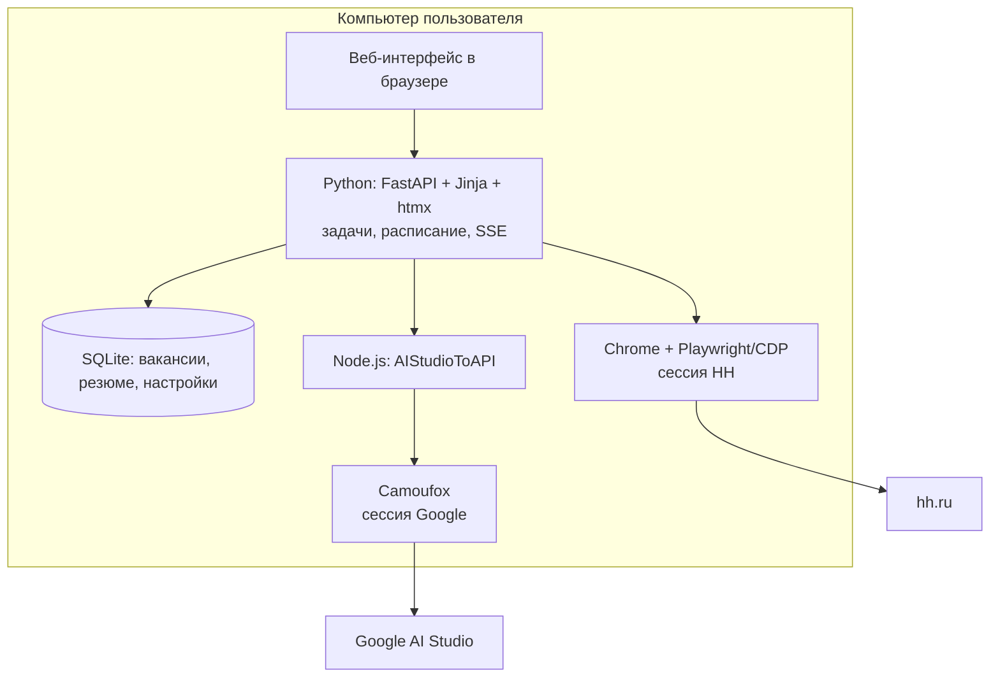
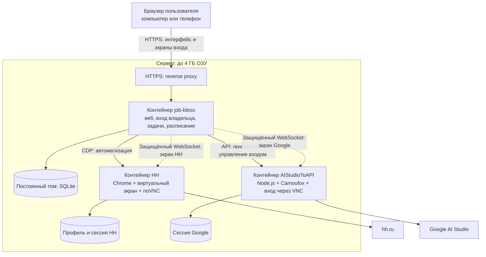

# Вход в HH и Google: сервер и локальный запуск

Дата: 10 сентября 2026. Этот документ сохраняет исходную архитектуру и согласованный план.
Реализация выполнена; актуальные команды запуска, ограничения и результаты проверки — в [server.md](server.md).
Проверен `main` на коммите `f7a4f2b`: после `git fetch --all --prune` он совпадает с `origin/main`.

Предлагается сохранить существующее приложение и перенести браузеры на сервер.
Входить в HH и Google можно будет через экран удалённого браузера прямо из job-bless.
После входа сервер работает самостоятельно, компьютер пользователя можно выключить.
Локальная сборка продолжает использовать обычные окна браузеров; Docker-вариант можно запускать и локально.

Исходное допущение: личная установка для одного владельца, одного активного аккаунта HH
и одного активного аккаунта Google AI Studio. Несколько резюме поддерживаются как сейчас.
Одновременная работа нескольких независимых пользователей потребует отдельного проектирования
изоляции данных и сессий и другого расчёта ресурсов.

## Исходное состояние до реализации

- Веб, планировщик и три очереди `main`, `activity`, `profile` находятся в одном Python-процессе.
  У основного приложения нет отдельного сервиса фронтенда: HTML и статика выдаются FastAPI.
  См. `src/web/app.py`, `src/web/tasks.py`, `src/web/scheduler.py`.
- HH использует общий браузерный контекст, отдельные вкладки для задач и общий ограничитель запросов.
  Профиль Chrome и `data/storage_state.json` сохраняют вход.
  См. `src/browser/session.py`, `src/browser/connector.py`, `src/web/jobs.py`.
- Google нужен для работы нейросети через AI Studio. Встроенный режим запускает Node.js и отдельный
  Camoufox. Данные входа находятся в `aistudio/configs/auth` внутри каталога данных.
  Обычный внешний API уже поддерживается как альтернативное подключение.
- SQLite используется по умолчанию; PostgreSQL поддерживается, но личной серверной установке не обязателен.

Серверные заготовки уже есть, но текущий запуск не завершён:

| Место | Что мешает переносу |
| --- | --- |
| `docker-compose.yml` | Есть PostgreSQL и браузер Camoufox с noVNC, но нет контейнера job-bless и AIStudioToAPI. |
| `src/web/jobs.py:login_job` | Вход жёстко подключается к Chromium через CDP, хотя общий коннектор умеет ещё Playwright/Firefox. Просто включить существующий Docker-браузер недостаточно. |
| `src/aistudio/runtime.py` | Встроенный запуск доступен только на Windows: проверка `os.name`, пути к `.exe`, блокировка через `msvcrt`. |
| `docker/camoufox/entrypoint.sh` | VNC запускается без пароля; Compose публикует браузерный WebSocket и noVNC напрямую. Для публичного сервера нужен закрытый доступ. |
| `src/web/app.py` | Есть необязательный общий токен для HTTP, но нет полноценного входа владельца и защиты будущего WebSocket удалённого экрана. |
| `configs/config.docker.yaml` | Имена сервисов рассчитаны на Docker-сеть, а сервис приложения отсутствует. В секции БД не указан `driver: postgres`, поэтому без переменной окружения остаётся SQLite. |

## Предлагаемая архитектура

Приложение остаётся одним процессом с одним экземпляром планировщика. SQLite хранится
на локальном постоянном диске. Redis, Celery и отдельный PostgreSQL для этого масштаба не нужны.
Отдельные контейнеры изолируют браузеры и позволяют ограничивать их память и перезапускать их независимо.

Для HH на первом этапе сохраняется Chrome/CDP: это уменьшает объём изменений в проверке входа
и существующей автоматизации. Из заготовки Camoufox можно переиспользовать виртуальный экран и noVNC.
Единый интерфейс управления браузером должен скрыть запуск локального процесса и подключение к серверному.
Вход и фоновые задачи должны использовать один управляемый профиль HH.

Для Google сервер использует отдельную Linux-сборку AIStudioToAPI. Уже закреплённый в проекте
коммит `db624c24ab111ad0f50308f20f8a75a216dbf873` описывает Docker-развёртывание и ручной вход через VNC.
Это готовая основа; интеграцию управления входом, состояния и авторизации с job-bless ещё нужно сделать.
Образ следует собирать из закреплённого коммита либо закреплять по проверенному digest.
[Документация AIStudioToAPI](https://github.com/iBUHub/AIStudioToAPI/blob/db624c24ab111ad0f50308f20f8a75a216dbf873/README_EN.md).

Windows продолжает использовать встроенный локальный runtime. Общий сервис подключения к Google
предоставляет одинаковые операции: начать вход, получить состояние, проверить модель, отключить.
Локальная реализация управляет дочерними процессами, серверная — взаимодействует с отдельным сервисом.
Передавать приложению Docker socket для этого не требуется.

## Как будет выглядеть вход

1. Владелец открывает job-bless и входит в свою панель.
2. Карточки «HH» и «Google AI Studio» показывают аккаунт и состояние подключения.
3. «Подключить HH» открывает экран серверного браузера на странице HH.
   Пользователь сам вводит пароль, SMS и решает капчу на сайте.
4. Приложение проверяет фактический вход, сохраняет сессию и импортирует резюме, как сейчас.
5. «Подключить Google» открывает такой же экран с Google/AI Studio. После входа приложение
   проверяет доступ к AI Studio и ответ модели, затем показывает «Подключено».
6. Экран можно закрыть. Дальнейшая работа идёт на сервере по расписанию.

Удалённый экран передаёт изображение настоящего браузера и нажатия пользователя.
Это позволяет пройти обычную форму входа без установки VNC-клиента; noVNC поддерживает
современные браузеры, включая мобильные. [Документация noVNC](https://novnc.com/info.html).

Предусмотреть состояния «Не подключён», «Ожидает входа», «Проверяем», «Подключён»,
«Нужен повторный вход», «Сервис недоступен». Истечение сессии и капча должны приводить
к понятной кнопке «Открыть браузер», а не к бесконечным повторным попыткам.
При ручном вмешательстве приостанавливаются все задачи, использующие соответствующий аккаунт,
включая фоновую активность. После закрытия экрана доступ по WebSocket отзывается;
браузер и профиль продолжают обслуживать разрешённые задачи.

Обычный «Войти через Google» на OAuth решает доступ к поддерживаемым Google API,
а текущему мосту нужна браузерная сессия AI Studio. По устройству существующего моста
OAuth-кнопка сама по себе не заменит этот вход.
[Google OAuth](https://developers.google.com/identity/protocols/oauth2).
Альтернатива с меньшим расходом памяти — прямой Gemini API по ключу; тогда контейнер Google-браузера
не нужен. Это другой способ доступа с собственными квотами и условиями, а не перенос сессии AI Studio.
[Ключи Gemini API](https://ai.google.dev/gemini-api/docs/api-key).

## Расчёт для 4 ГБ

Основную память потребляют браузеры. Начальные бюджеты ниже — проектные ориентиры для настройки
и нагрузочного прогона, а не измеренные значения и не обещание отсутствия OOM.

| Компонент | Начальный бюджет |
| --- | ---: |
| job-bless, Python и SQLite | 384 МиБ |
| HH: Chrome, виртуальный экран и VNC | 1024 МиБ |
| Google: AIStudioToAPI, Camoufox и экран входа | 1536 МиБ |
| HTTPS-прокси | 128 МиБ |
| Всего контейнеры | 3072 МиБ |

Оставшиеся примерно 0,7–1 ГБ нужны Linux, Docker и системному запасу — в зависимости
от того, означает ли тариф 4 GB или 4 GiB. Документация AIStudioToAPI оценивает один активный
аккаунт примерно в 700 MB, но рабочий предел нужно проверить на реальных страницах и во время входа.
[Оценка автора AIStudioToAPI и MAX_CONTEXTS](https://github.com/iBUHub/AIStudioToAPI/blob/db624c24ab111ad0f50308f20f8a75a216dbf873/README_EN.md#environment-variables).

Для первого серверного режима: `MAX_CONTEXTS=1`, один общий запрос к нейросети одновременно
для всех очередей, ограниченное число вкладок HH, фоновая активность по умолчанию выключена.
При повторном входе в Google генерация останавливается и рабочий браузер освобождается,
чтобы браузер входа не создавал третий тяжёлый процесс сверх бюджета.
Сборка образов выполняется заранее. `shm_size` задаёт размер общей памяти, но сам по себе
не ограничивает общее потребление контейнера; память ограничивается отдельно.

## Данные, доступ и локальный режим

- Весь веб-доступ идёт через один origin: страницы, SSE и WebSocket экранов. Это упрощает
  HTTPS и устраняет необходимость отдельных CORS-разрешений для интерфейса.
- Для сервера обязателен вход владельца: пароль хранится как хеш, сессия имеет срок действия,
  cookie использует HttpOnly/Secure/SameSite. Изменяющие запросы защищены от CSRF.
  WebSocket отдельно проверяет сессию, Origin и право на текущий экран; существующего HTTP middleware недостаточно.
- CDP, Playwright, VNC, служебный API моста и его внутренний WebSocket не публикуются в интернет.
  На экраны распространяется та же авторизация, что и на панель. Ключ моста остаётся на backend.
- SQLite, профиль HH и auth-файлы Google размещаются в отдельных постоянных томах,
  переживают обновление контейнеров и резервируются согласованно. Секреты и cookies не попадают в журналы.
- Для переноса существующей установки использовать согласованную копию SQLite через backup API
  или после остановки записи. Настройки с локальными адресами адаптировать к серверу;
  расписание включать после проверки аккаунтов и резюме. Первичный вход на сервере предпочтителен:
  копирование cookies между ОС и IP не гарантирует сохранение авторизации.
- Поддержать одну кодовую базу с двумя режимами окружения: локальный запуск Windows/из исходников
  и Docker Compose. Локальный Docker использует ту же серверную сборку с локальным адресом;
  серверный вариант добавляет домен и HTTPS. Возможность включать необязательный сервис AI Studio
  можно оформить профилем Compose. [Профили Docker Compose](https://docs.docker.com/compose/how-tos/profiles/).
- По умолчанию локальный интерфейс доступен на loopback. Для доступа по LAN предусмотрены
  явная привязка к `0.0.0.0`, отдельный порт и включённая авторизация. Вход с другого устройства
  через экран браузера обеспечивает локальный Docker-вариант.

Google может отклонить вход из автоматизированного браузера: удалённый экран не гарантирует
его принятие. Это нужно проверить на целевом сервере до завершения всей интеграции.
[Условия входа в Google](https://support.google.com/accounts/answer/7675428).
У AI Studio также есть ограничения доступности по регионам; при выборе сервера проверить
доступ к обоим сайтам и доступность AI Studio для аккаунта.
[Доступные регионы Google AI Studio](https://ai.google.dev/gemini-api/docs/available-regions).

## Порядок реализации и критерии готовности

1. Проверить узкий сценарий на Linux с лимитом 4 ГБ: удалённый вход в HH и Google, сохранение
   сессий, перезапуск, повторный доступ. Реальные пароли и подтверждения вводит владелец.
2. Добавить контейнер job-bless, браузер HH, закреплённый образ Google-моста,
   постоянные тома, healthcheck, лимиты памяти и конфигурации локального/серверного запуска.
3. Выделить управление браузером и подключением Google в адаптеры; подключить их к общему
   сценарию входа. Сохранить импорт резюме, проверку реального аккаунта и безопасную отмену смены.
4. Добавить вход владельца и защищённые экраны HH/Google в текущие карточки интерфейса.
   Реализовать повторный вход и приостановку задач при ручном управлении браузером.
5. Проверить перезапуск, отвал браузера, истечение сессии, отказ WebSocket без авторизации,
   конфликт ручного входа с заданиями и реальное максимальное потребление памяти.
   Проверка недоступности Google не должна называться ошибкой пароля, если проблема в сети.
6. Проверить локальную Windows-сборку и локальный Compose на отдельной копии существующих данных.
   В UI должны открываться правильные экземпляры браузеров с отдельными портами и профилями.

Готовность: владелец подключает оба аккаунта через веб, закрывает свой компьютер, задания
продолжают работать на сервере; после перезапуска валидные сессии восстанавливаются,
а при необходимости повторного входа интерфейс явно просит действия пользователя.
При аварии прерванные отклики не повторяются вслепую: перед повторной отправкой проверяется состояние на HH.
Нагрузочный прогон укладывается в доступную память, локальный запуск остаётся рабочим.

В этой задаче выполнены анализ кода и проверка документации. Добавлен только этот документ;
Docker-стек не развёрнут, вход на сервере и расход RAM ещё не проверены. Приложение для просмотра
изменений не запускалось, поскольку пользовательский интерфейс не менялся.
