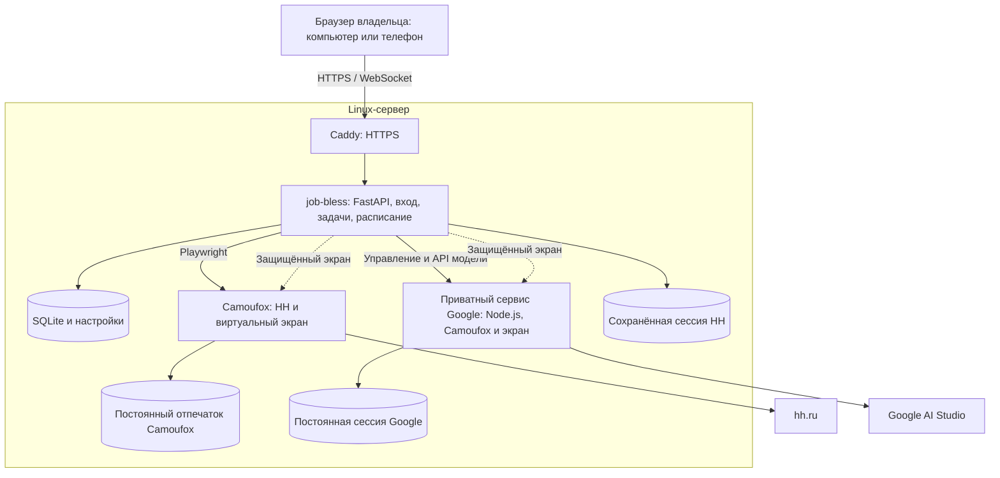

# Сервер, вход в аккаунты и локальный Docker

Личная установка для одного владельца, одного активного аккаунта HH и одного Google AI Studio.
Откройте панель, введите её пароль и подключите аккаунты в разделе «Действия».
Кнопки показывают настоящие браузеры на сервере: пароль, SMS, подтверждение Google и капчу
вы вводите на страницах самих сайтов. После подтверждения входа окно можно закрыть.
Для работы по расписанию ваш компьютер больше не нужен.

## Как устроено

Везде одна схема для HH: **job-bless → Docker → Camoufox → hh.ru**.
Локальный Python-процесс и Windows-комплект сами собирают и запускают контейнер
Camoufox. Docker Compose запускает тот же образ вместе с приложением на сервере
или на компьютере. Выбирать браузер, CDP или транспорт в панели больше не требуется.
Google в Windows-комплекте использует встроенные Node.js и Camoufox; в Compose
для него есть отдельный необязательный сервис. Фронтенд обслуживает само приложение.

Серверная установка:



Один процесс приложения и SQLite достаточны для личной установки. Redis, отдельный
PostgreSQL и Docker socket не используются. Не запускайте несколько копий приложения
на одной БД: у каждой копии собственный планировщик.

## Подготовка

Нужны Docker Engine с Compose 2.24+ и Python 3.11+ для первоначальной настройки.
Для Docker Desktop включите Linux-контейнеры. Все команды выполняются из корня репозитория.
Production использует готовые образы из GHCR. Зависимости и браузеры уже находятся
в образах; на сервере не нужны Node.js, компиляторы или сборка Dockerfile.
Первое скачивание требует нескольких гигабайт свободного диска.

## Образы в GHCR и GitHub Actions

Workflow `.github/workflows/docker.yml` собирает три образа для `linux/amd64` и `linux/arm64`:

| Сервис Compose | Образ |
| --- | --- |
| `app` | `ghcr.io/yn9m/job-bless-app` |
| `hh-browser` | `ghcr.io/yn9m/job-bless-hh` |
| `aistudio` | `ghcr.io/yn9m/job-bless-aistudio` |

Push в `main` публикует тег `latest`, push тега `v1.2.3` — тег `v1.2.3`.
Каждая публикация также имеет тег `sha-<полный SHA коммита>`. Теги `latest` и версии
обновляются только после успешной сборки всех трёх образов. В pull request выполняется
проверочная сборка без публикации. Workflow можно запустить вручную; запуск из другой
ветки публикует только SHA-тег и не меняет `latest`.

Workflow использует встроенный `GITHUB_TOKEN` с `packages: write`; добавлять PAT в secrets
не требуется. Образы связываются с репозиторием через OCI-метку `org.opencontainers.image.source`.
В форке имена образов автоматически используют владельца и имя этого форка.
Production по умолчанию использует `yn9m/job-bless`; другой источник задаётся через
`JOB_BLESS_IMAGE_PREFIX` в `.env`.

После первой публикации владелец репозитория может сделать три пакета публичными
в GitHub → Packages → Package settings → Change visibility. Тогда сервер скачивает их
без авторизации. Для приватных пакетов предварительно выполните `docker login ghcr.io -u USERNAME`
и введите PAT (classic) с `read:packages` в запросе пароля. У аккаунта должен быть доступ к пакетам.
Подробнее: [авторизация и видимость GHCR](https://docs.github.com/en/packages/working-with-a-github-packages-registry/working-with-the-container-registry).

Для production рекомендуется закрепить один и тот же SHA-тег для всего стека в `.env`:

```dotenv
JOB_BLESS_IMAGE_PREFIX=ghcr.io/yn9m/job-bless
JOB_BLESS_IMAGE_TAG=sha-<полный SHA из успешного запуска Actions>
```

Точные строки `.env` и имена образов отображаются в Summary успешного workflow.
Пока workflow не попал в `main` и не завершил первую публикацию, образы недоступны.

## Настройка данных и пароля

Скрипт создаёт `.env`, отдельный каталог данных, хеш пароля панели и приватный ключ сервиса Google:

```bash
python3 scripts/configure_server.py --generate-password
```

В Windows используйте `python` вместо `python3`. Пароль появится в `.env.password`.
Без `--generate-password` скрипт попросит придумать пароль из 12 или более символов.
Скрипт не перезаписывает существующий `.env`, файл пароля или базу.
Не добавляйте `.env`, `.env.password` и каталог данных в Git.

Если уже работали локально, перенесите данные отдельной копией:

```bash
python3 scripts/configure_server.py --generate-password --database /path/to/career_agent.db
```

Если в этом checkout есть `data/career_agent.db`, она копируется автоматически.
Копирование использует SQLite backup API и учитывает WAL, исходная БД остаётся прежней.
История, вакансии, резюме и пользовательские настройки сохраняются. Расписание и нейросеть
в копии выключаются, HH требует нового подтверждения входа. Cookies локального Chrome
и Google автоматически не переносятся. Подключите аккаунты, проверьте параметры, затем
включите нужные действия по расписанию самостоятельно.

## Локальное приложение из исходников или Windows-комплекта

1. Запустите Docker Desktop с Linux-контейнерами (Windows) или Docker Engine (Linux).
2. Из исходников выполните `uv sync --frozen --no-install-project`, затем
   `uv run --no-project python main.py web`. В Windows-комплекте достаточно ярлыка.
3. Откройте личную ссылку из журнала запуска; Windows-ярлык открывает её автоматически.
4. В карточке HH нажмите «Открыть браузер» и войдите на сайте внутри панели.

При первом запуске приложение собирает закреплённый образ, журнал — `hh-build.log`
рядом с SQLite. При следующих запусках сборка нужна только при изменении компонентов
образа. Установленный Chrome не используется. Старые browser.provider/headless/CDP
настройки игнорируются; история и резюме остаются, в HH нужно войти заново.

У каждой папки данных свой контейнер `job-bless-hh-<id>`, Docker volume с отпечатком
и два свободных порта на loopback. Порты закреплены и сохраняются при рестарте.
Второй процесс с той же папкой данных блокируется. При обычном выходе контейнер
останавливается, сессия остаётся в `hh-session.json`. После сбоя следующая попытка
подключения восстанавливает сохранённую сессию; незавершённый ручной вход может потребовать повтора.

Для доступа из локальной сети задайте `WEB_HOST=0.0.0.0`, откройте личную ссылку,
заменив `127.0.0.1` на IP компьютера. Ссылка даёт доступ к панели — передавайте её только
своим устройствам. Можно вместо ссылки настроить `WEB_PASSWORD_HASH`. Для постоянной
работы всего стека используйте Compose ниже.

## Локально, включая доступ с телефона

Для доступа только с этого компьютера:

```bash
docker compose pull
docker compose up -d --no-build
```

Откройте [локальную панель](http://127.0.0.1:8080). Для доступа по домашней сети
при первоначальной настройке используйте `--bind 0.0.0.0 --port 8080`, либо измените
`WEB_BIND` в созданном `.env` и выполните `docker compose up -d`.
На телефоне откройте `http://IP-компьютера:8080` и введите пароль панели.
В экране входа есть кнопки «Клавиатура» и «Крупнее»; увеличенный экран можно перетаскивать.
Для публичного сервера используйте HTTPS-вариант ниже.

Для разработки и проверки незапубликованных изменений собирайте локальные образы:

```bash
docker compose -f docker-compose.yml -f compose.build.yml up -d --build
```

`compose.build.yml` добавляет сборку и отдельные локальные имена образов.
При работе с этим вариантом добавляйте оба `-f` к последующим командам Compose.
Первый build скачивает зависимости и браузеры и может занять несколько минут.

## Linux-сервер с HTTPS

Направьте DNS домена на сервер и откройте входящие TCP 80/443; UDP 443 нужен только для HTTP/3.
При первой настройке укажите свой домен:

```bash
python3 scripts/configure_server.py --generate-password --domain jobs.example.com
docker compose -f docker-compose.yml -f compose.server.yml pull
docker compose -f docker-compose.yml -f compose.server.yml up -d --no-build
```

Для существующего `.env` задайте `SITE_DOMAIN`, повторять configure не требуется.
Caddy получает и обновляет TLS-сертификат автоматически. Панель находится на вашем домене.
В этом режиме наружу опубликованы только порты Caddy; порт приложения снимается из публикации.
Порты VNC, Playwright и Google API доступны только внутри Docker-сети.

### Существующий Traefik

Если сервер уже использует Traefik, вместо `compose.server.yml` подключите
`compose.traefik.yml`. Нужны внешняя Docker-сеть `traefik-public`, точка входа
`websecure` и резолвер сертификатов `letsencrypt`. Например, отдельный Traefik
из [vless-docker](https://github.com/jellybebra/vless-docker) с Cloudflare DNS challenge;
сервисы VLESS для приложения не требуются.

```bash
python3 scripts/configure_server.py --generate-password --domain jobs.example.com
docker compose -f docker-compose.yml -f compose.traefik.yml pull
docker compose -f docker-compose.yml -f compose.traefik.yml up -d --no-build
```

Traefik направляет HTTPS на порт 8080 приложения через общую сеть. Порт приложения
не публикуется на хосте; HH и Google остаются в приватной сети стека.
Публичный URL и Secure cookies задаются автоматически по `SITE_DOMAIN`.
Для последующих команд обновления и остановки также указывайте оба файла Compose.

Пароль панели хранится как PBKDF2-хеш. Сессия владельца действует 12 часов, после перезапуска
приложения нужно войти снова. Cookies имеют HttpOnly/SameSite, в HTTPS-режиме также Secure.
Действия защищены от CSRF; экран доступен лишь с активной сессией и проверенным Origin,
не более 15 минут на открытие. Второе устройство не может захватить уже открытый экран.
Выход из панели сразу закрывает доступ к экранам.

## Аккаунты и восстановление

В карточке HH нажмите «Войти в hh.ru» или «Открыть браузер». Перед ручным входом
приложение останавливает обе очереди, работающие с HH. Пока экран открыт, новые браузерные
задачи не запускаются. Фактический вход подтверждается по странице аккаунта, после чего
автоматически импортируются резюме. Смена аккаунта сохраняет прежнюю сессию до успешной проверки новой.

При распознанном переходе HH на капчу, страницу входа или запрет доступа задача завершается
с понятным сообщением. Страница проверки сохраняется, новые действия HH ждут подтверждения
входа; планировщик продолжает проверять готовность без повторных запросов к HH.
Изменения разметки сайтов могут потребовать обновления распознавания.

В карточке нейросети нажмите «Подключить Google AI Studio». Окно входа открывается автоматически.
После авторизации нужно дождаться доступа к редактору AI Studio и проверки реального ответа модели.
Только после этого показывается «Подключено» и включается нейросеть. Google-сервис выполняет
один API-запрос за раз, включая потоковые ответы. Сохранённый вход используется после
перезапуска; если он истёк, нажмите «Войти в Google».

Доступность AI Studio зависит от аккаунта, региона и решения Google о входе из браузера.
Обычная OAuth-кнопка не заменяет cookies, которые использует этот мост.
[Условия входа Google](https://support.google.com/accounts/answer/7675428),
[доступные регионы AI Studio](https://ai.google.dev/gemini-api/docs/available-regions).

## Память

| Контейнер | Жёсткий лимит |
| --- | ---: |
| Приложение, SQLite, Playwright driver | 384 МиБ |
| HH, Camoufox, виртуальный экран | 1024 МиБ |
| Google, Node.js, Camoufox, виртуальный экран | 1536 МиБ |
| HTTPS-прокси | 128 МиБ |
| Всего | 3072 МиБ |

Проверены вход в HH в Camoufox, совместный контекст задач и восстановление cookies,
localStorage и IndexedDB после перезапуска контейнера на синтетических данных.
Полный прогон генерации требует подключённого Google-аккаунта.
Для тарифа до 4 ГБ оставлен запас под Linux и Docker; длинные ответы, тяжёлые страницы
и объёмная БД могут приблизиться к лимитам. Смотрите фактическое потребление:

```bash
docker compose stats --no-stream
docker compose ps
docker compose logs --tail 100 app aistudio
```

Google можно заменить внешним API, убрав его браузер и расход памяти. Для новой установки
добавьте `--api-only` к configure. Для существующей задайте пустые `COMPOSE_PROFILES`
и `AISTUDIO_SERVICE_URL` в `.env`, остановите `aistudio` и пересоздайте `app`.
Подключение API настраивается в карточке нейросети.

## Доступ Google к интернету

Если Google возвращает `Region not supported`, браузеру контейнера нужен доступ
к AI Studio из поддерживаемого региона. Системный прокси Windows автоматически
в контейнер не передаётся. Укажите `GOOGLE_PROXY_URL` в `.env`; для Docker Desktop
и локального v2rayN с портом 10808 это `http://host.docker.internal:10808`.
Затем выполните `docker compose up -d aistudio` и нажмите «Запустить снова».
Прокси должен быть доступен из Docker; Google-аккаунт в томе сохраняется.
На сервере с прямым доступом к Google оставьте `GOOGLE_PROXY_URL` пустым.

## Данные, резервная копия и обновление


Каталог из `JOB_BLESS_DATA_PATH` содержит SQLite и `hh-session.json` (cookies, localStorage,
IndexedDB). Отпечаток Camoufox находится в named volume `hh-profile`, Google — в `google-data`. Имена томов имеют префикс
Compose-проекта: при обновлении используйте прежний каталог/имя проекта, иначе получите новые тома.
Копируйте `.env` и все три хранилища в закрытую резервную копию. Для простой согласованной
копии остановите стек, сохраните каталог данных и тома, затем поднимите тот же стек.
Снимок только SQLite не является резервной копией браузерных аккаунтов.

```bash
docker compose stop
# Резервная копия каталога данных, .env и named volumes средствами вашего сервера.
# Укажите новый JOB_BLESS_IMAGE_TAG в .env — один тег для всего стека.
docker compose pull
docker compose up -d --no-build
```

Для HTTPS-установки к каждой команде добавляйте `-f docker-compose.yml -f compose.server.yml`.
Не используйте `down -v`, если хотите сохранить аккаунты: этот флаг удаляет named volumes.
После `up -d --no-build` проверьте состояния контейнеров и карточки аккаунтов.
Для отката верните предыдущий `JOB_BLESS_IMAGE_TAG`, затем повторите `pull` и `up -d --no-build`.
Если новая версия изменила формат данных, восстановите совместимую резервную копию.
Публикация в GHCR сама по себе не перезапускает production: обновление запускается этими командами.

Смена пароля панели: получите новый хеш командой ниже, замените `WEB_PASSWORD_HASH` в `.env`
и пересоздайте `app` через `docker compose up -d app`. Существующие сессии панели отзовутся.

```bash
python3 -c "import getpass; from src.passwords import hash_password; print(hash_password(getpass.getpass('New panel password: ')))"
```

Приватный ключ Google должен совпадать в приложении и Google-сервисе. Если меняете
`AISTUDIO_SERVICE_KEY`, пересоздайте оба контейнера. В интерфейс этот ключ не передаётся.
